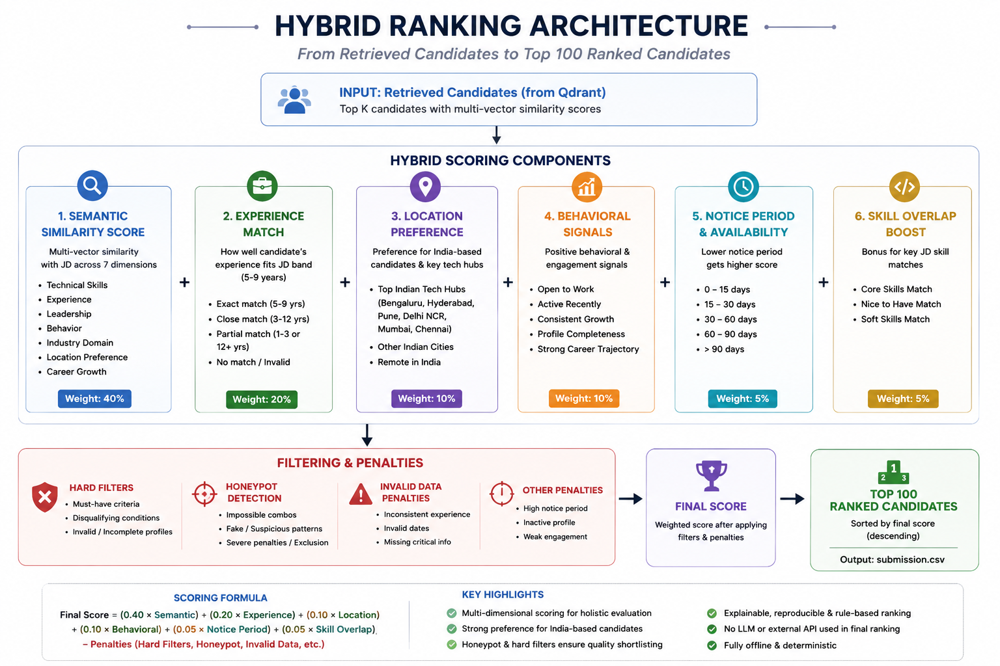
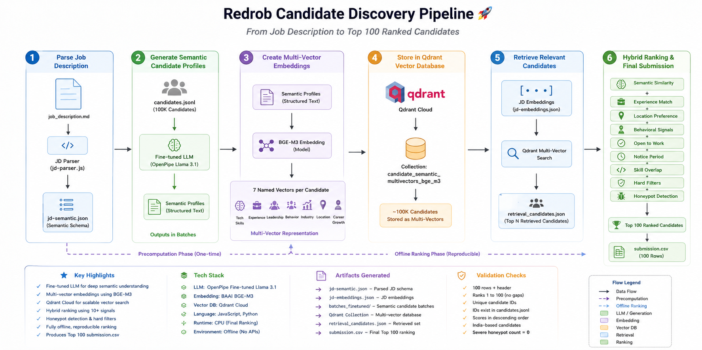
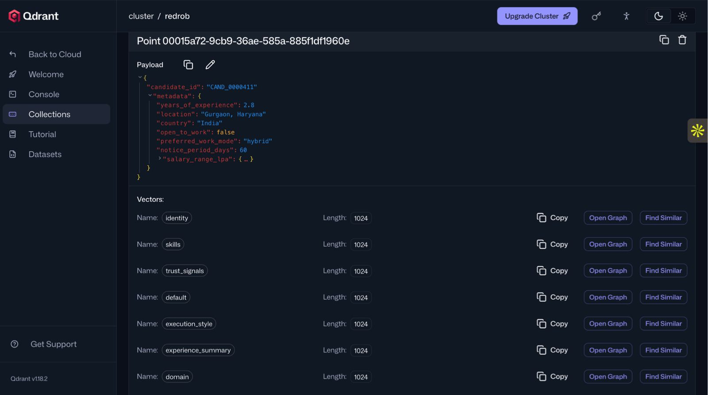
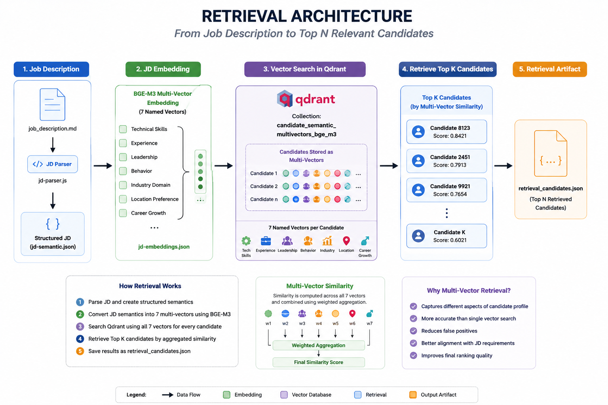
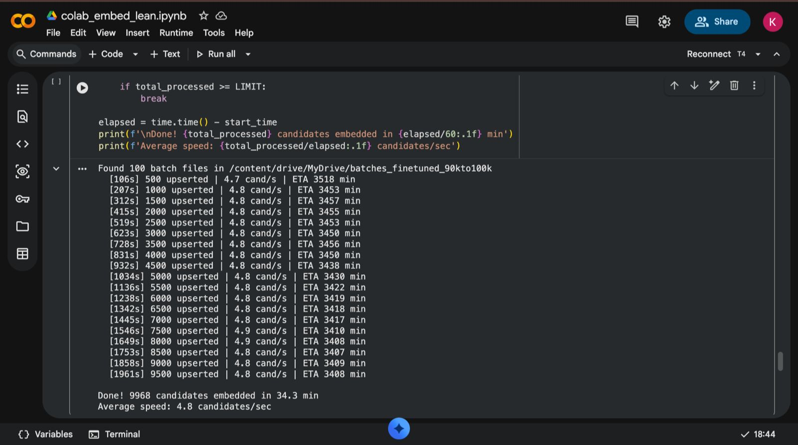
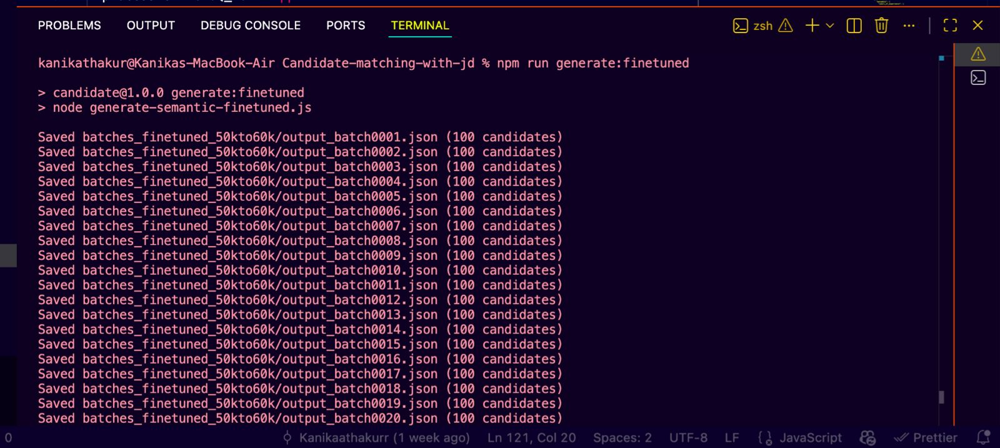

# Redrob Candidate Matching With JD

This repository contains our submission code for the Redrob / India Runs Data & AI candidate discovery challenge. It produces the final top-100 `submission.csv` for the provided Senior AI Engineer job description.

Final submission format:

```text
candidate_id,rank,score,reasoning
```

## Quick Reproduction

Put the official `candidates.jsonl` from the hackathon bundle in the repo root, then run:

```powershell
python rank.py --candidates candidates.jsonl --retrieval retrieval_candidates.json --out submission.csv
```

This is the single command used to reproduce the final CSV. It runs offline, CPU-only, with no network, no Qdrant call, and no LLM call during ranking. On our machine it completes in under 1 minute.

The checked-in `retrieval_candidates.json` is the precomputed retrieval artifact. Precomputation may take longer than the final ranking window, but the final ranking command above is the only command needed to regenerate `submission.csv`.

## Docker Reproduction

The final ranking step can also be run in Docker. The official `candidates.jsonl`
is intentionally not committed; place it in the repo root first.

Build:

```powershell
docker build -t algora-redrob-ranker .
```

Run:

```powershell
docker run --rm -v ${PWD}/candidates.jsonl:/app/candidates.jsonl -v ${PWD}/submission.csv:/app/submission.csv algora-redrob-ranker
```

This Docker path is the sandbox fallback for the submission metadata. It runs the same offline ranking command and does not require network access during ranking.

## What The Ranker Does

The final `rank.py` path uses:

- Precomputed semantic retrieval scores from Qdrant/BGE-M3.
- Hard filters before ranking:
  - India candidates only.
  - Minimum 4 years experience.
  - Onsite, hybrid, or flexible work mode by default.
- JD fit scoring:
  - AI/ML/search/retrieval/ranking skill evidence.
  - Production and evaluation signals such as deployed systems, NDCG, MRR, MAP, A/B testing.
  - Experience-band fit for the JD's preferred 5-9 year range.
  - Location preference for relevant Indian tech hubs.
- Redrob behavioral scoring across the provided signal set:
  - Activity, response rate/speed, notice period, salary fit, work mode fit, relocation, GitHub, recruiter saves, interview/offer rates, identity verification, assessments, endorsements, and profile completeness.
- Honeypot/impossible-profile checks:
  - Zero-month expert skills.
  - Skill durations exceeding total experience.
  - Career-history date inconsistencies.
  - Suspicious Redrob signal contradictions.
  - Severe honeypot candidates are excluded.
- Concise 1-2 sentence reasoning using only candidate facts.
  

## Architecture

The full pipeline has two phases.



**Offline precompute phase**

1. Parse the JD into a structured semantic JD.
2. Generate/prepare semantic candidate text.
3. Embed candidate semantic axes with BGE-M3 named vectors.
4. Store vectors in Qdrant Cloud with minimal payload:
   - `candidate_id`
   - metadata needed for hard filtering
5. Embed the JD with the same BGE-M3 axes.
6. Query Qdrant to create `retrieval_candidates.json`.
   

**Final ranking phase**

1. Read `candidates.jsonl`.
2. Read `retrieval_candidates.json`.
3. Apply hard filters and honeypot filtering.
4. Score JD fit, Redrob behavior, location, experience, and disqualifiers.
5. Write `submission.csv`.

## Important Artifacts

- `submission.csv`  
  Final top-100 output.
- `rank.py`  
  Final offline ranker used for the submitted CSV.
- `retrieval_candidates.json`  
   Precomputed Qdrant retrieval scores used by `rank.py`.
  

- `candidate_qdrant_embedding_example.json`  
   One complete trace for `CAND_0011687`: raw dataset object, semantic batch object, and the actual Qdrant stored embeddings. It shows the vector names and full 1024-dimensional vectors for each axis.
  

- `jd-semantic.json` and `jd-embeddings.json`  
  Parsed semantic JD and BGE-M3 JD embeddings.
- `submission_metadata.yaml`  
  Portal metadata file mirroring the required submission metadata.

## Pipeline Commands

Install dependencies:

```powershell
npm install
```

Parse the JD:

```powershell
npm run parse:jd
```

Create JD embeddings:

```powershell
npm run embed:jd
```

Prepare/evaluate semantic fine-tuning data:

```powershell
npm run finetune:prepare
npm run finetune:evaluate
```

Generate semantic candidate batches with the deployed OpenPipe fine-tuned model:

```powershell
$env:OPENPIPE_API_KEY="..."
$env:FINETUNED_BASE_URL="https://app.openpipe.ai/api/v1"
$env:FINETUNED_MODEL="openpipe:cruel-cooks-search"
$env:FINETUNED_OUTPUT_DIR="batches_finetuned"
$env:FINETUNED_START_OFFSET="0"
$env:FINETUNED_LIMIT="1000"
$env:FINETUNED_CONCURRENCY="3"
npm run generate:finetuned
```



Embed semantic batches into Qdrant:

```powershell
$env:BATCHES_DIR="batches_finetuned"
$env:QDRANT_URL="https://your-cluster.region.cloud.qdrant.io"
$env:QDRANT_API_KEY="..."
$env:QDRANT_COLLECTION="candidate_semantic_multivectors_bge_m3"
npm run embed:batches
```

Regenerate `retrieval_candidates.json` from Qdrant:

```powershell
$env:QDRANT_URL="https://your-cluster.region.cloud.qdrant.io"
$env:QDRANT_API_KEY="..."
$env:QDRANT_COLLECTION="candidate_semantic_multivectors_bge_m3"
$env:JD_EMBEDDINGS_FILE="jd-embeddings.json"
$env:RETRIEVAL_ALL="true"
$env:RETRIEVAL_SCROLL_BATCH_SIZE="512"
npm run precompute:retrieval
```

Run the final ranker:

```powershell
npm run rank
```

## Validation

Run:

```powershell
npm test
python rank.py --candidates candidates.jsonl --retrieval retrieval_candidates.json --out submission.csv
```

Current final output:

- 100 rows plus header.
- 100 unique candidate IDs.
- Top candidate: `CAND_0011687`.
- All selected candidates pass the final hard filters.
- All selected candidates are below the honeypot severity cutoff.

## Repository Contents

Core final-submission files:

```text
rank.py
retrieval_candidates.json
submission.csv
candidate_qdrant_embedding_example.json
submission_metadata.yaml
requirements.txt
README.md
```

Pipeline/source files:

```text
index.js
index-batched.js
jd-parser.js
embed-jd.js
generate-semantic-finetuned.js
generate-semantic-batches-v2.js
generate-semantic-batches-v3.js
prepare-finetune-data.js
evaluate-finetuned-semantic.js
embed-batches-qdrant.js
precompute-retrieval.js
search-qdrant.js
rerank-candidates.js
rag-pipeline.js
hard-filters.js
redrob-signals.js
detect-honeypots.js
```

Small checked-in precompute artifacts:

```text
jd-semantic.json
jd-embeddings.json
retrieval_candidates.json
```

Intentionally not committed:

- `.env` and API keys.
- `node_modules/`.
- `model_cache/`.
- `qdrant_storage/`.
- Generated semantic batch folders.
- The full `candidates.jsonl` dataset. Use the official hackathon bundle copy in the repo root when reproducing locally.
